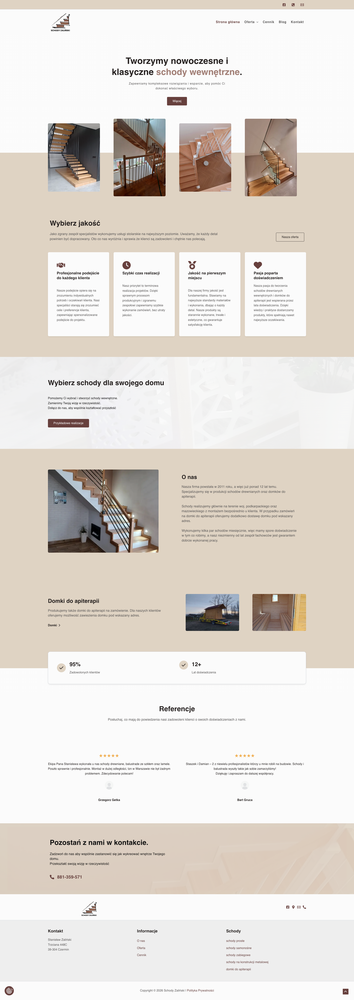
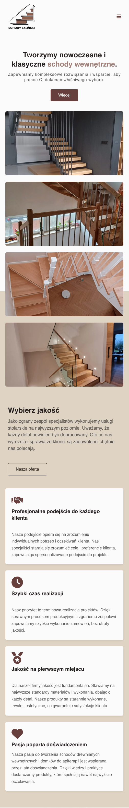

# Schody Zaliński - Custom WordPress Theme & Business Website

## 📌 Overview

An end-to-end implementation of a modern, responsive business website for a wooden stairs manufacturer. This project involved full-cycle digital product development: from initial UI/UX and logo design to custom theme development, copywriting, legal compliance (Privacy Policy, ToS), and final production deployment.

[**🔗 Visit the live website**](https://schodyzalinski.pl/)

---

## 📸 Screenshots

  
  
<i>Desktop View</i>

  
   
  
  
  
<i>Mobile View</i>

---

## 🚀 Features
* **Custom UI/UX & Branding:** Designed the visual identity, including a custom logo.
* **Responsive Design:** Fully optimized for desktop, tablet, and mobile devices.
* **Custom WordPress Theme:** Built from scratch using PHP and SCSS without relying on heavy page builders, ensuring fast load times.
* **SEO Optimized:** Structured semantic HTML and meta tag configuration for high search engine visibility.
* **Blog Module:** Integrated a scalable blogging system for content marketing.

## 🛠️ Tech Stack
* **CMS:** WordPress
* **Backend:** PHP, MySQL
* **Frontend:** HTML5, SCSS, JavaScript
* **Design:** Figma (Logo & UI/UX)

## 💡 Key Takeaways
This project demonstrates my ability to manage the entire lifecycle of a digital product independently. It required balancing technical performance with business goals (lead generation, SEO) while maintaining clear communication with the client.